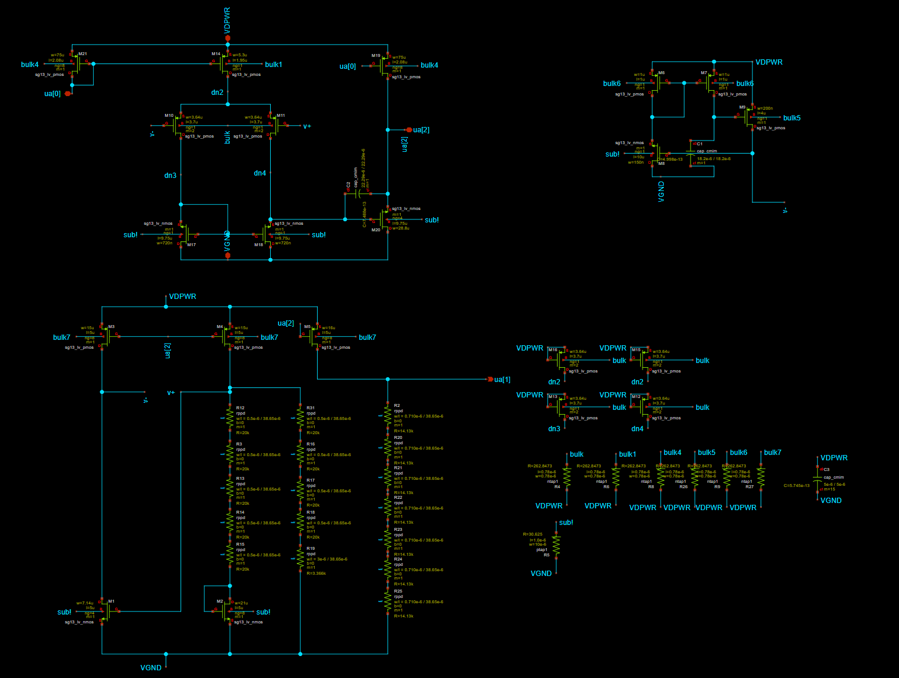

 

## How it works

It is simple band gap reference. Design was adopted from [https://github.com/IHP-GmbH/IHP-AnalogAcademy/blob/main/modules/module_1_bandgap_reference/part_3_layout/BGR_layout/final_bandgapreference/full_bandgap_layout_filled.gds](https://github.com/IHP-GmbH/IHP-AnalogAcademy/blob/main/modules/module_1_bandgap_reference/part_3_layout/BGR_layout/final_bandgapreference/full_bandgap_layout_filled.gds). Main work was to insert it correctly into IHP PDK grid and take car of its integration into multi project wafer from Tiny Tapout. 

## How to test

Connect 5uA current source to Iout to bias opamp. Check if Vbg voltage is bandgap refernece (aorund 600mV). Check if bandgap reference voltage stays at 600mV over full temperature range -40 to 125 Celcius degries. 

## External hardware

Simple current mirror with potentiometer to set 5uA current should do the work.
